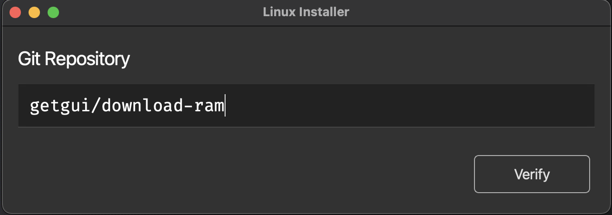
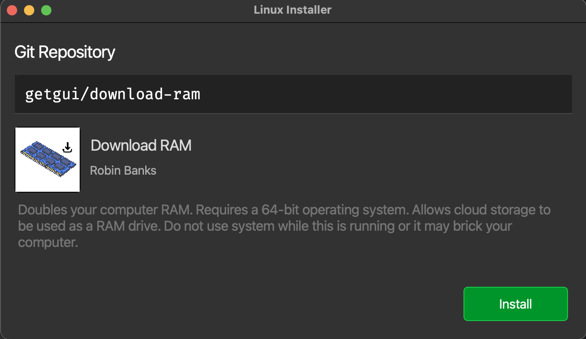
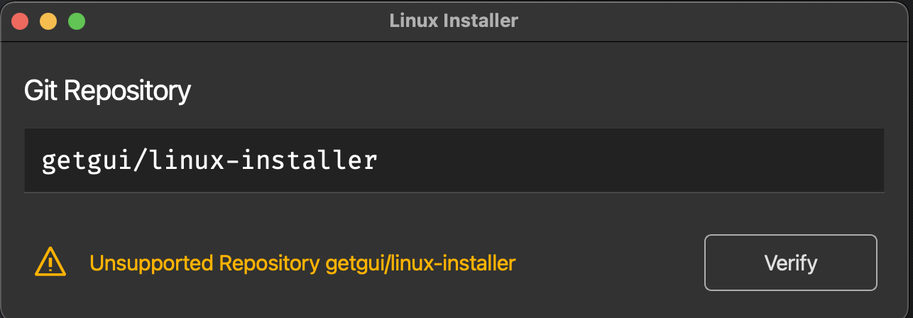

# linux-installer
GUI installer for github projects with lni.yaml file

## Rough Idea
1. Repos contain lni.yaml script

Sample
```
AppName: XYZ
Author: Robin Banks
InstallScript: scripts/install.sh
IconPath: icons/medium.png
RequiresClone: False
```

2. Repo name `e.g. getgui/linux-installer` is entered.
3. App checks if repos as lni.yaml script
4. Checks if it requires repo cloning and clone.
5. Run the install script.

## Latest State

First Screen (before verification)



Second Screen (after application verification)


Third Screen (verification failed)

